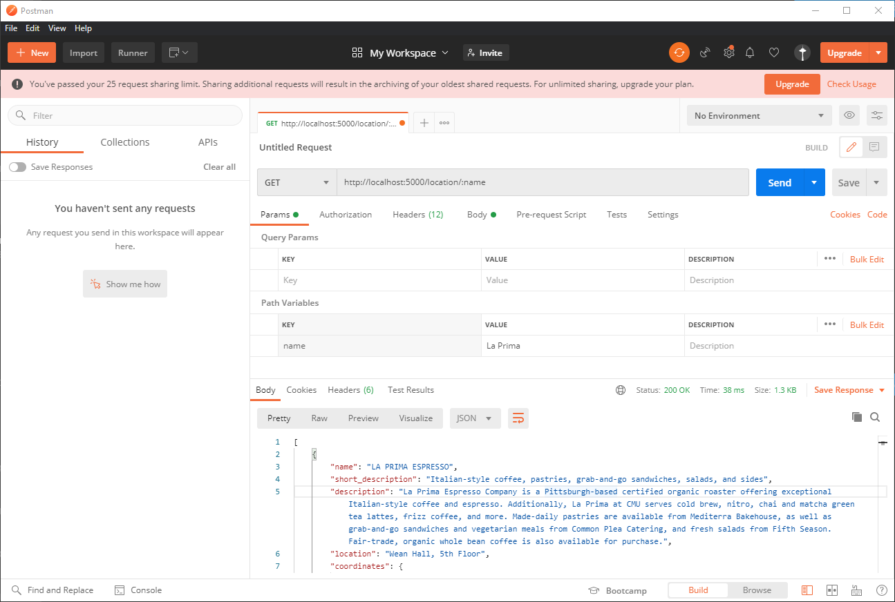

# WDW Node.JS Talk Lab
Welcome to WDW 2020! In this lab, we will be having a hands-on learning experience with Node.JS and Express. Here, you will build a basic RESTful API to simulate our own ScottyLabs [**Dining API**][dining-api] but using a static data source.

## Downloads
| Program | URL |
|---|---|
|Node.JS| https://nodejs.org/en/download/ |
|Postman| https://www.postman.com/downloads/ |

## Table of Contents
> 1. [Setup](#setup)
> 2. [Starting Your Express App](#starting-your-express-app)
> 3. [Sending Data](#sending-data)
> 4. [Request Parameters](#request-parameters)
> 5. [Testing with Postman](#testing-with-postman)

## Setup
Install both Node.JS and Postman normally. Once that is done, create a folder on your computer called `node-lab`. We will be working on the lab inside this folder. Inside this directory, create a file called `index.js`. This will be your starter file and where you will develop your server code. Additionally, download the [data file][data-file] and place it in your lab folder as well.


Once that's done, initialize your project and install Express by running this on your terminal:
```
$ npm init -y
$ npm install express
```

You will see that some new files have been created as well as a folder called `node_modules`. `node_modules` contains the Express installation as well as other dependencies that Express relies on. If you decide to share your code with others through GitHub, for example, you typically don't want to send the `node_modules` folder since this can become very large. All the important information is already stored inside `package.json` and `package-lock.json`, so to address this issue, create a file called `.gitignore`. Inside `.gitignore` enter `node_modules` on one line. What this does is tell Git to ignore `node_modules` when you commit your changes. (If you're not familiar with how Git and GitHub works, check out the recording of our GitHub session)

To test that everything works as expected, type `console.log("Hello World!");` inside your `index.js` file and run your project:
```
$ node index.js
```
You should see `Hello World!` printed to your terminal. At this point, your directory should look like this:
```
. (/node-lab)
├── node_modules
├── .gitignore
├── dining.json
├── package-lock.json
├── package.json
```

## Starting your Express App
We will start by building an Express app inside `index.js` that responds to a basic GET request:
```javascript
const express = require("express");

const app = express();
const PORT = 5000;

app.get("/", (req, res) => {
  res.send("Welcome to the Dining API!");
});

app.listen(PORT, () => {
  console.log(`App listening on port ${PORT}`);
})
```
We'll break down this chunk of code section by section.
```const express = require("express");```
> This line imports the Express library into our project, allowing us to use Express functionalities on our server.

`const app = express();`
> We initialize our express server instance in this function call. This is essentially our "server object" and we will be manipulating this as we configure our server.

`const PORT = 5000;`
> This is the [port](ports) that we want our app to run on. If you're not familiar with the concept of ports, feel free to just copy this but if you encounter issues running your app, try changing this port to another number.

 ```javascript
app.get("/", (req, res) => {
  res.send("Welcome to the Dining API!");
});
```
> This block tells our server object that we want to listen for HTTP `GET` requests as indicated by the `app.get()` function call. 
> 
> The first parameter of the function call is `"/"` which indicates that this block will be handling function calls to the base route. We will learn more about routes later in this lab, but a quick summary is that if you had a website called `something.com`, this would correspond to all requests sent to `something.com` or `something.com/`.
>
>The second parameter of the function call is an [anonymous function][anon-func] that takes two parameters: `req` and `res` and then runs:

```javascript
res.send("Welcome to the Dining API!");
```

>`req` is short for *request* and contains information sent to our server from the client. We will see later how we can use this to send back different types of data, depending on what the client wants
>
>`res` is short for *response*. This is how we will be interacting with the client to send back different kinds of data or errors depending on the request they sent.
> 
> In this example, we don't care about their request and always send back the text: "Welcome to the Dining API"

```javascript
app.listen(PORT, () => {
  console.log(`App listening on port ${PORT}`);
})
```
> Here, we are calling the `app.listen` function to make our Express server start listening on the `PORT` that we specified earlier. Optionally, what is known as a *callback function* is passed into the function call as the second parameter. This is a function that is run after the Express server finishes starting up. In our case, we print a message that lets us know that everything's ready to go.

## Sending data
Now that we have a basic server set up, we want to send actual data back to the user. This is where our *surprise tool*, `dining.json`, will come in handy.

At the top of `index.js`, add this line:
```javascript
const dining = require("./dining.json");
```

The data you downloaded is stored in a format called [JSON][json]. This format allows us to store structured data in plain text. Luckily for us, we don't have to worry about parsing this data as Node.JS does this automatically for us. The line of code above does just that. It imports the data from `dining.json` and stores it in the `dining` variable.

After this, we want to create an endpoint, or route, where people can send requests to retrieve this data. Let's make this data accessible at `/locations`.

To do that, create another block of code after your root route that listens for requests to `/locations` and sends the `dining` data as JSON:
```javascript
app.get("/locations", (req, res) => {
  res.json(dining);
});
```
From the last section, we learned that `res` allows us to send a response back to the client. Here, instead of just sending a plain message back to the client, we send the dining object back to the user, but make sure to send it back in the JSON format, as specified with the `res.json` function call.

Test this endpoint by running:
```
$ node index.js
```
then check your browser and go to [http://localhost:5000/locations]. You should see a huge chunk of JSON data identical to what is found in your `dining.json` file.

## Request Parameters
Now what if you only want to get specific data and the huge dataset all at once? What if you only want to know the information about La Prima? In this section, we will be building an endpoint that responds to specific request parameters.

Once again, create another block of code:
```javascript
app.get("/location/:name", (req, res) => {
  const filteredLocations = []
  for (location of dining.locations) {
    if (location.name.includes(req.params.name)) {
      filteredLocations.push(location);
    }
  }
  res.json(filteredLocations);
});
```
You might have noticed that our route looks a bit different this time. The `:name` in our route refers to the `name` parameter that we will be using in our route handler. This means that the parameter gets passed into our URL so that requests sent to `/location/underground` or `/location/prima` all get sent to this handler.

How our function works is here is that you are creating a list of filtered locations to search for all locations in our dining dataset that contain the queried keyword.

Try this out yourself by running your program and sending a request to `/location/prima`. 

Don't see anything? This is because if you look at the dataset, there's only an entry for La **P**rima, but you're searching for **p**rima. I'll leave this as an exercise for you to figure out how to solve :)

As another exercise, design a route that returns what restaurants are open at a specific time of the day. Tinker with the data that is accessible to you through `dining.json`. Here's a boilerplate to get you started:
```javascript
app.get("/location/time/:day/:hour/:min", (req, res) => {
  // Your code here
});
```

## Testing with Postman
You might be wondering, how would you go about passing parameters with spaces like searching for "La Prima", for example? This is where Postman comes in handy. Make sure that your server is running, then launch Postman. You'll see an orange layout and a field where you can enter a request URL. Enter the URL you would use to find information about a specific location but use `:name` instead of an actual name.



You'll notice another section on Postman appear with the option to fill in path variables. Here, you can actually enter a value with spaces like the word "La Prima". This is just the tip of the iceberg that is using Postman. It will come in handy as you dive into your journey of backend development.

Well, that's it for this lab! Stay tuned for the next talk on React where you will learn how to build a frontend to display this content in a more readable manner to your users.

## Things to Explore
| Resource | Description |
|---|---|
| [MongoDB][net-ninja-mongo] | Learn to work with more than just static data using the powerful NoSQL database: MongoDB |
| [Mongoose][mongoose] | Simplifying the MongoDB interfafce |
| [Authentication with JWT][net-ninja-jwt] | Secure your web apps with authentication using JSON Web Tokens (JWT) |

[dining-api]: https://apis.scottylabs.org/docs
[data-file]: dining.json
[ports]: https://www.dummies.com/programming/networking/cisco/network-basics-networking-port-overview/
[anon-func]: https://www.w3schools.com/js/js_function_definition.asp
[json]: https://developers.squarespace.com/what-is-json
[net-ninja-mongo]: https://www.youtube.com/playlist?list=PL4cUxeGkcC9jBcybHMTIia56aV21o2cZ8
[net-ninja-jwt]: https://www.youtube.com/playlist?list=PL4cUxeGkcC9iqqESP8335DA5cRFp8loyp
[mongoose]: https://mongoosejs.com/


